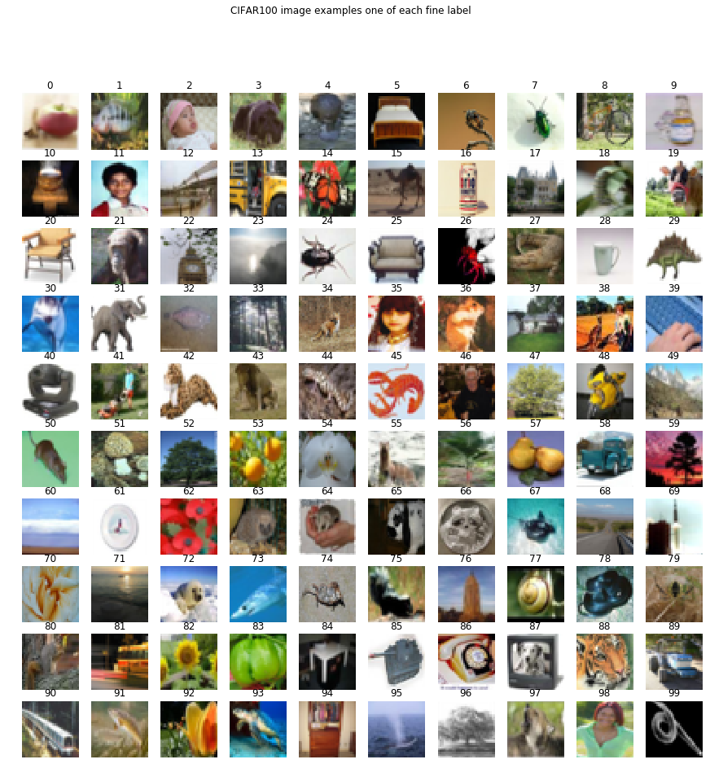

# Capstone project on CIFAR-100 image classification
Comparison of various transfer learning techniques for classification of images from [CIFAR-100](https://www.cs.toronto.edu/~kriz/cifar.html) dataset.

## Dataset

CIFAR-100 dataset consists of 60000 color images in 100 classes and 20 superclasses. Each image comes with a "fine" label (the class to which it belongs) and a "coarse" label (the superclass to which it belongs). Each image is of the size 32x32 with RGB features, so the single data sample has 32x32x3=3072 features.

The dataset is partitioned to training (50000) and testing (10000) samples. The list of classes and superclasses can be found [here](https://www.cs.toronto.edu/~kriz/cifar.html) and this [notebook](data_exploration.ipynb)

### Loading dataset

The script `utils.py` provides methods to download and load the data and labels.
```python
import utils
train_data, train_coarse_label, train_fine_label, test_data, test_coarse_label, test_fine_label = utils.load_dataset()
coarse_label_names, fine_label_names = utils.load_label_names()
```

When loaded, `train_data` is a list of training images with `train_coarse_label` and `train_fine_label` as the corresponding coarse and fine labels. For example, the $i$-th image is stored in the array `train_data[i]` (with shape `(32,32,3)`) with its coarse label in `train_coarse_label[i]` (integer number in `range(20)`) and fine label in `train_fine_label[i]` (integer number in `range(100)`).

Another way to load the data is to use the [Keras datasets](https://keras.io/datasets/).

### Some example images

The `iPython` notebook
[data_exploration.ipynb](data_exploration.ipynb)
explores the data and shows some examples images from each of 100 classes in CIFAR100.



## Classification

The classification problem does supervised learning using only the **training** data (50000 images of CIFAR10) and **testing** data as the **validation** data. We shall not use separate testing data and measure the performance using the **validation accuracy** and henceforth be referred as **accuracy**. I shall only discuss the accuracy of the fine labels here, as the benchmark models focus on it. However, the repo contains those corresponding to coarse labels too.

We have applied some of the many approaches applicable to the classification problem. We used Tesl K80 and Paperspace P4000 GPU compute machine for running the code and notebooks.

### Simple CNN

The first approach builds a simple few layer CNN and trains it from scratch. This approach does not give spectacular results. We obtained an accuracy about **44%** with [cifar100_cnn.py](cifar100_cnn.py) and results are available [here](https://www.floydhub.com/lapjarn/projects/cifar100_capstone/jobs).

Benchmark architectures with their accuracies are listed in this [website](https://benchmarks.ai/cifar-100).

The best performance of image classification task is obtained by CNN architectures with very deep neural networks. Training those SoTA models require heavy computational processing power with GPUs and even then takes hours or days or weeks to train. So we have applied two methods of using someone else's pretrained models and applying it to the CIFAR100 dataset.

### Transfer Learning using bottleneck features

We used transfer learning using bottleneck features on ResNet50 model pretrained on the ImageNet dataset. In this approach, we do not include the last softmax layer of the model which does the final classification of images into classes. We extract the predicted features using the model by running it on CIFAR100 images and then add a classifier to classify the images. These features are referred to as bottleneck features or CNN codes.

We got an accuracy of above **70%** with just 30 epochs and very short time as shown in this [notebook](transfer_learning_100.ipynb).

We have used [Keras](https://keras.io/applications/) for importing the pretrained models.

### Fine tuning pre-trained models

In this approach, we freeze all but last few layers of the pretrained model. Then we train the model on our dataset and hence update the parameters of the model. We used ResNet50 again for this approach and made the last residual layer trainable. We got an accuracy of above **60%** but required more time and started to overfit quickly as implemented in this [notebook](fine_tuning_100.ipynb).

Transfer learning using bottleneck seems to be the better approach in our case as our dataset is similar to ImageNet but size is very small compared to it. Fine tuning is more appropiate in case our dataset is also large. 

Stanford's [CS231n](http://cs231n.github.io/transfer-learning/) course gives a good description of possible scenarios and which methods are applicable in those scenarios. 

### Wide Residual Network

We also trained a WRN 28-8 model and achieved validation accuracy of **65%** in 60 epochs. Wide Residual Networks (BMVC 2016) http://arxiv.org/abs/1605.07146 by Sergey Zagoruyko and Nikos Komodakis achieves accuracy over **82%** on the CIFAR-100 dataset in about 200 epochs. Our implementation has less accuracy due to less epochs and different optimizer and hyperparameter values. We just trained it to compare the training times with the other models.

Bottleneck features transfer achieves comparable performance to lower benchmark models in less epochs and training time. Fine tuning and WRN take over 5 minutes per epoch using NVidia P4000 GPU while bottleneck model just took around 15s per epoch.
